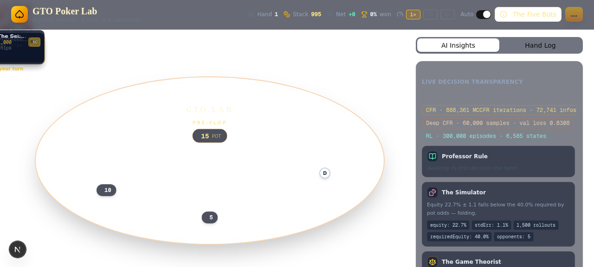
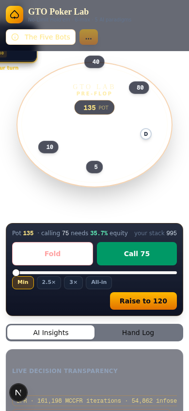

# Texas Hold'em AI Lab

**A 6-max No-Limit Texas Hold'em poker engine with five AI paradigms — and the mathematics to prove what they're doing.**

This repository contains a complete, self-contained poker AI research project:

1. **A full 6-max NLHE engine** (betting rules, side pots, showdown, blind rotation) with exhaustive fairness verification.
2. **Five AI paradigms** playable at the table, each with a *transparent reasoning panel* so you can see exactly why every agent acted as it did: rule-based heuristics, Monte-Carlo equity estimation, tabular CFR (blueprint abstraction), Deep CFR (function approximation), and tabular Q-learning.
3. **Training pipelines** for every learned agent, reproducible from the command line.
4. **A 100,000-hand tournament** benchmark across all paradigms, with statistically sound methodology (per-hand stack reset, button-relative seat rotation, blind-corrected accounting, empirical standard errors).
5. **A 27-page academic paper** (LaTeX source + compiled PDF): *The Mathematics and Algorithms of Texas Hold'em Poker* — probability, game theory, CFR with full derivations, reinforcement learning, and the experimental results above.



## Results at a glance

100,000 hands, 5 paradigms sharing one table with a rotating shadow seat. Zero chip-conservation errors, zero illegal actions across the entire run.

| Agent | Win rate (bb/100) | z-score | VPIP | PFR | Aggression |
|---|---:|---:|---:|---:|---:|
| **Deep CFR** (MLP advantages) | **+144.7** | +6.9 | 62.0 | 58.7 | 56.5 |
| **Rule-based** | **+79.3** | +3.8 | 60.9 | 3.2 | 10.8 |
| RL (tabular Q-learning) | −26.2 | −5.1 | 6.3 | 4.7 | 8.8 |
| Monte Carlo (1,500 rollouts) | −51.9 | −7.3 | 25.2 | 12.9 | 15.6 |
| Tabular CFR (blueprint) | −170.0 | −9.7 | 58.6 | 46.6 | 40.6 |

**Headline finding:** at small training budgets, *generalization beats table completeness*. Deep CFR's function approximation (+144.7 bb/100) dominates the tabular blueprint (−170 bb/100), whose 888k-iteration, 72,741-infoset table is still too coarse for the full game — the abstraction (18.7% near-uniform rows, preflop max-prob 0.49) leaks equity that a small MLP trained on advantage targets does not.

Full methodology, per-block breakdowns, and diagnostics: see [`paper/`](paper/) Section 8.

## Quick start

Requires Node.js 18+ (Bun recommended) and a package manager of your choice.

```bash
bun install          # or: npm install
bun run dev          # or: npm run dev  →  http://localhost:3000
```

No environment variables and no database are required — the engine, evaluator,
and all five agents run entirely client-side in the browser.

The app ships with **pre-trained artifacts** in [`public/ai/`](public/ai/) — the table works immediately, no training required:

| File | Paradigm | What it is |
|---|---|---|
| `cfr-blueprint.json` | Tabular CFR | 888,361 iterations of external-sampling MCCFR, 72,741 infosets |
| `deepcfr-model.json` | Deep CFR | Small MLP (14→32→4) predicting counterfactual advantages |
| `rl-policy.json` | RL | Tabular Q-learning policy, 6,585 states, self-play vs mixed pool |

Pick any of the 5 AI types for each opponent seat, deal, and inspect every agent's reasoning in real time — strategy mixes, equity estimates, Q-values, and neural advantages are all rendered live in the insight panels.



## Repository layout

```
texas-holdem-ai/
├── src/
│   ├── app/                          # Next.js app router (single-page table UI)
│   ├── components/poker/             # Table, seats, action bar, insight panels, hand log
│   ├── components/ui/                # shadcn/ui primitives
│   ├── hooks/
│   │   └── use-poker-game.ts         # Client-side game loop state machine
│   └── lib/poker/
│       ├── engine.ts                 # 6-max NLHE engine: betting, side pots, showdown
│       ├── cards.ts                  # Seeded RNG + deck utilities
│       ├── evaluator.ts              # 7-card hand evaluator with score description
│       ├── abstraction.ts            # Action & card abstraction (info buckets)
│       ├── preflop-table.generated.ts# 169 starting-hand equity buckets (generated)
│       ├── agents/                   # rule-based · monte-carlo · cfr · deepcfr · rl
│       └── training/                 # Abstract game definition + ES-MCCFR solver
├── public/ai/                        # Trained artifacts (committed, ready to play)
├── scripts/                          # Training / tournament / verification / figures
│   ├── train-cfr.ts                  # ES-MCCFR blueprint trainer
│   ├── train-deepcfr.ts              # Advantage-network trainer (walk + fit)
│   ├── train-rl.ts                   # Q-learning self-play trainer
│   ├── tournament.ts                 # N-hand 6-max benchmark (per-block)
│   ├── aggregate-tournament.py       # Statistics + z-scores across blocks
│   ├── kuhn-cfr.ts                   # Kuhn poker CFR solver — exact equilibrium check
│   ├── gen-preflop.ts                # Regenerates preflop equity table
│   ├── gen-*-figures.py              # Paper figure generation (matplotlib)
│   └── test-*.ts                     # Engine correctness / fairness test suite
├── paper/                            # LaTeX source, figures, compiled PDF
├── docs/screenshots/                 # App screenshots
├── gitignore                         # Rename to .gitignore after web upload (see below)
├── package.json / tsconfig.json / next.config.ts / tailwind.config.ts / postcss.config.mjs / eslint.config.mjs
```

## Uploading to GitHub

**Via the web interface (drag and drop).** GitHub's web uploader has two
restrictions this repository is already prepared for:

1. It **skips hidden files** — anything whose name starts with a dot (that is
   the "this file is hidden" message). This package therefore contains no
   dot-prefixed files; the ignore rules ship as `gitignore` (no leading dot).
2. It accepts **at most 100 files per upload**. This package contains 95 files
   — a single drag-and-drop of the extracted folder is enough.

After uploading, make the ignore rules active (one 10-second fix):

1. Open `gitignore` in the GitHub file view and click the pencil (edit) icon.
2. Change the filename field from `gitignore` to `.gitignore`.
3. Commit — contents stay identical, the leading dot makes Git use it.

**Via the command line** (no restrictions, recommended if you have git):

```bash
git init
git add .
git commit -m "Initial commit: Texas Hold'em AI Lab"
git branch -M main
git remote add origin https://github.com/<you>/texas-holdem-ai.git
git push -u origin main
```
(In this flow, rename `gitignore` → `.gitignore` before `git add`.)

## Deploying to Netlify

The repository is pre-configured for one-click Netlify deployment — no
environment variables, no database, nothing to fill in. The entire game
(poker engine plus all five AI agents) runs in the browser, so the site
deploys as static files on Netlify's CDN:

1. Push the repository to GitHub (see above).
2. On [netlify.com](https://www.netlify.com), choose **Add new site →
   Import an existing project**, and pick your GitHub repository.
3. Netlify reads `netlify.toml` automatically: build command
   `npm run build:netlify`, publish directory `out`, Node 22. Click
   **Deploy**.

Netlify sets `NETLIFY=true` during its build, which makes `next.config.ts`
switch to `output: "export"` and emit the static site into `out/`. Every
subsequent `git push` redeploys the site automatically.

To preview the exact production bundle locally (Unix shells):

```bash
npm install
NETLIFY=true npm run build:netlify   # emits the static site into out/
npx serve out                        # or: python3 -m http.server -d out 3000
```

For local development, plain `npm run dev` (or `bun run dev`) behaves
normally — the export mode only activates in the Netlify build environment.

## Training & experiments

All commands run from the repository root with [Bun](https://bun.sh) (or `npx tsx` equivalents).

```bash
# Retrain each agent (argument = time budget in ms)
bun run scripts/train-cfr.ts 1500000        # ~25 min → public/ai/cfr-blueprint.json
bun run scripts/train-deepcfr.ts 120000 240000  # walk + train budgets → deepcfr-model.json
bun run scripts/train-rl.ts 300000          # → rl-policy.json

# Regenerate the preflop equity table (169 hands × MC vs random opponent)
bun run scripts/gen-preflop.ts

# Verify the CFR implementation on Kuhn poker
# (converges to the exact game value −1/18 and the 1:3 bluff:value family)
bun run scripts/kuhn-cfr.ts

# Run the tournament: 5 blocks × 20,000 hands
bun run scripts/tournament.ts 0 20000
bun run scripts/tournament.ts 1 20000
bun run scripts/tournament.ts 2 20000
bun run scripts/tournament.ts 3 20000
bun run scripts/tournament.ts 4 20000

# Aggregate results + z-scores
python3 scripts/aggregate-tournament.py

# Engine correctness & fairness suite
bun run scripts/test-engine.ts
```

Tournament design notes (why you can trust the numbers):

- **Per-hand stack reset** — every hand is an i.i.d. sample; no wealth compounding across hands.
- **Button-relative rotation** — every paradigm occupies every position (BTN/SB/BB/UTG/MP/CO) uniformly.
- **Blind-corrected accounting** — stacks are snapshotted before blinds post; chip conservation is asserted every hand.
- **Empirical standard errors** — z-scores use the per-hand standard deviation, not a normality assumption.

## The paper

[`paper/main.pdf`](paper/main.pdf) — *The Mathematics and Algorithms of Texas Hold'em Poker* (27 pages, A4).

- **§1–2** Motivation and the formal game model (extensive form, information sets, 6-max structure)
- **§3** Probability: hand ranks, combinatorics, preflop equity (with computed tables)
- **§4** Hand evaluation & Monte-Carlo estimation (precision analysis)
- **§5** Game theory: Nash equilibrium, best response, exploitability — with a worked Kuhn poker example and game tree diagram
- **§6** CFR: regret matching, regret decomposition theorem, CFR+ / MCCFR variants, abstraction, Deep CFR — with two algorithm boxes and full derivations
- **§7** Reinforcement learning: why MDP formulations fail in imperfect information, NFSP, DeepStack / Libratus / Pluribus, and our Q-agent
- **§8** Experiments: the 100k-hand tournament above, plus blueprint diagnostics
- **§9** Conclusions

Recompile from source with [Tectonic](https://tectonic-typesetting.github.io/) or any LaTeX toolchain:

```bash
cd paper && tectonic main.tex    # or: pdflatex main.tex (×2 for references)
```

Figure sources live in [`paper/figures/`](paper/figures/) and are regenerable via the `scripts/gen-*-figures.py` utilities (requires Python 3 + matplotlib + numpy).

## Engine verification

The engine's fairness was verified exhaustively during development:

- **Deal distribution**: card-by-card comparison against an independent replication — 0 mismatches.
- **Winner determination**: brute-force evaluator cross-check — 0 wrong winners.
- **Award arithmetic**: chip-conservation assertions on every hand — 0 violations.
- **Seat fairness**: identical agents across 10 seeds — worst seat z = 2.5, worst position z = 3.6 (within multiple-testing noise).

The test scripts are included in [`scripts/`](scripts/) — see `test-engine.ts`, `test-card-diff.ts`, `test-winner-diff.ts`, `test-assert-awards.ts`, and `test-fairness-final.ts`.

## Tech stack

- **Next.js 16** (App Router) · **React 19** · **TypeScript**
- **Tailwind CSS 4** + **shadcn/ui** (Radix primitives) · Framer Motion
- Pure client-side game loop — the engine, evaluator, and all agents run in the browser
- **Bun** scripts for training/tournament workloads (no runtime dependencies beyond the app itself)

## License

Released under the [MIT License](LICENSE). The paper (`paper/`) is included in the same license; if you cite it, please reference *"The Mathematics and Algorithms of Texas Hold'em Poker, Cathy Li, 2026"*.
